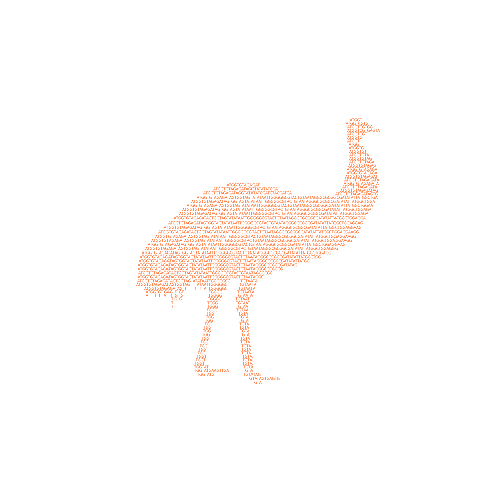

# Evaluation of MUtations via reference Simulation: EMUS
 <p align="center"></p>
**Version 1.0.0**

NOTE: THIS PROGRAM IS STILL UNDER DEVELOPMENT AND NOT READY FOR GENERAL USE.

EMUS is a pipeline and tool for statistically evaluating the frequency of mutational classes in genomic studies. This is accomplished in two primary steps. First, random mutations are generated across your organisms reference genome. Second, the same number or mutations that were observed are randomly selected from the simualted mutations. The frequencies of mutational classes (i.e., synonymous, missense, intergenic, etc.) are then compared. This process is then repeated for n number of bootstraps, and the probability that the observed mutational classes orccured at higher or lower frequencies than randomly expected is computed. 

This documentation is a quick overview of the emus functionality. More examples and tutorials will be uploaded upon package completion.

## Installation
The simplest way to install EMUS is to setup the emus conda environment and then pip install this repository:
```
conda env create evo-informatics/emus
conda activate emus
pip3 install git+https://github.com/gabe-dubose/emus.git
```
Another option would be to download or clone this repository and use the emus-env.yaml file to create a conda environment with the dependencies:
```
git clone https://github.com/gabe-dubose/emus
cd emus
conda env create --file emus-env.yaml
pip3 install git+https://github.com/gabe-dubose/emus.git
```
Althogh not recomended, you can also install the dependencies manually and then clone this repository. It is recomended that these either be installed with pip and/or conda:

Dependencies:
  - Python3
  - SnpEff
  - Seaborn
  - Matplotlib

## General Workflow and Tutorial

### Simulating mutations in the reference genome
The simulate_mutations.py script takes an input genome in fasta format and simulates a flat number of SNPs. The output from this program is a variant call file (VCF) containing the number of mutations you specificed. However, if you are looking for more custom and fine-grained simulations, we recomend using Mutation-Simulator. The output VCF from this program is able to be incorporated in EMUS as well. 
```
simulate-mutations \
-i/--input    <reference_genome.fasta> \
-s/--snp      <#snps> \
-o/--output   <output_file.vcf>
```

### Optional: Visualizing simulation
EMUS offers a visualization feature for manually inspecting the distribution of mutations across each of your references chromosomes. The VCF generated by EMUS or Mutation-Simulator can be used as input. The output generated is an individual plot for each histogram, so we recomend making a separate directory to put these in.
```
mkdir output_dir
plot-vcf-histogram \
-i/--input    <simulated_mutations.vcf> \
-o/--output   <output_dir>
```

### Annotating variants
For variant annotation, EMUS wraps SnpEff. However, other variant annotations programs can also be used and reincorporated into downstream analyses. Annotating variants is done in two parts. First, the user must either select a pre-built SnpEff database or build one manually.

#### Finding and installing a pre-built database
To search for a pre-built SnpEff database, you can use the annotate_variants.py script:
```
annotate-variants \
-f/--find <genus_species>   
```
#### Downloading a pre-built database
Once the desired database has been found, you can download it as:
```
annotate-variants \
-d/--download_db <databaseID>
```
#### Building a database
To build a SnpEff database, you must have a genome fasta file, and a genes features file, such as a .gtf file. 
```
add-snpeff-db \
-o/--organism     <genus_species> \
-i/--db_id        <database ID> \
-g/--genome       <genome.fasta> \
-f/--features     <features.gtf>
```
For more advanced database building options, see the SnpEff documentation.

#### Annotating variants
Once reference database is in order, variants can be annotated using annotate_variants.py.
```
annotate-variants \
-i/--input        <variants.vcf> \
-r/--reference    <reference database> \
-o/--output       <output> 
```
Note that this same script can be used for both observed and simulated VCFs

### Comparing observed and simulated variants
We must first extract the relevant information from the annotated VCF files:
```
read-vcf \
-i/--input        <annotated_variants.vcf> \
-o/--output       <output.tsv> 
```
This will return a tab separated file that contains the variant annotations in the first column. At this point in the workflow, any tab separated file with variant annotations in the first column can be used. We can now compare the observed an simulated comparisons:
```
compare-variants \
-i/--input        <observed_variants.tsv> \
-c/--comparison   <simualted_variants.tsv>  \
-b/--bootstraps   <#bootstraps> \
-o/--output       <output_file_handle> \
```
This program will produce a plain .tsv file that will have the probability values for each mutation class. It will also produce a .bootstraps.tsv file that will contain the relevant information for visualization. 

### Visualizing comparisons
With the .boostraps.tsv file generated in the previous step, EMUS offers plotting options to generate publication quality figures. These visualizations include histograms, kernel density estimate (KDE) plots, emperical cumulative density estimate plots (ECDF), as well as options for figure customization and coloring.
```
mkdir out_dir
compare-variants \
-i/--input          <data.bootstraps.tsv> \
-o/--outdir         <out_dir>  \
Optional Flags:
--hist
--kde
--ecdf
--color_tail        <color>
--comp_line_color   <color>
--plot_color        <color>
--blank_bars
--background_theme  <white or dark>
```

